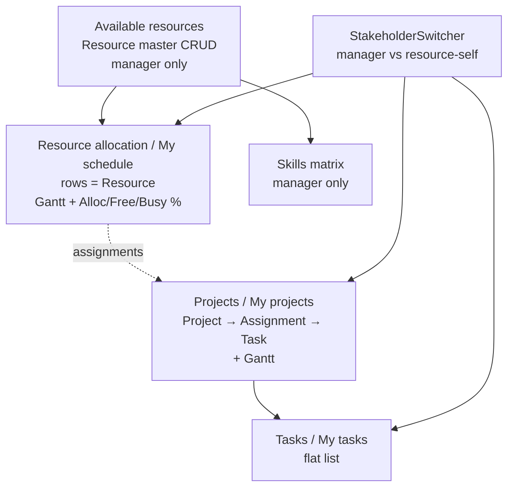

# Projsys — AI continuity brief

> Read this file first before changing code. It is the source of truth for product intent, architecture, and current behavior.

## One-line summary

Single-user, Excel-like **human resource / project planning** web app. Next.js + React + TypeScript. Domain data in **PostgreSQL** via **Prisma** and Next.js Route Handlers (`/api/app-data`). No real auth (demo stakeholder switcher only).

## How to run

```bash
cd /workspace   # or your local clone path
cp .env.example .env   # if needed; default URL matches docker-compose
npm install
npm run db:up          # starts Postgres 16 via Docker Compose
npx prisma migrate deploy
npm run prisma:seed    # optional; GET /api/app-data also auto-seeds when empty
npm run dev -- --port 3000
```

Open http://localhost:3000  
**Reset demo data:** header → “Reset data” (reseeds Postgres from `createSeedData()`).

If Docker is unavailable, point `DATABASE_URL` at any PostgreSQL 16 instance and create a user/db matching the URL (default `projsys` / `projsys` / `projsys`).

If Turbopack errors with “Next.js package not found”, reinstall deps (`npm install`) and restart. Prefer not combining `pkill -f "next"` with the same shell that starts the server.

---

## Product tabs (UI labels → code)

| UI label | `TabId` | Component | What the user does here |
|----------|---------|-----------|-------------------------|
| Projects | `projects` | `ProjectsTab.tsx` | Project-centric hierarchy: **Project → Assignment(resource) → Tasks**. Gantt on the right. |
| Resource allocation | `allocations` | `ResourcesTab.tsx` | **Resource-centric** planning grid (one row per person) + multi-bar Gantt. Conflict expand tree. |
| Available resources | `available` | `AvailableResourcesTab.tsx` | Master list of people (CRUD). Status Available / Booked for today. |
| Skills | `skills` | `SkillsTab.tsx` | Resource × skill matrix (levels `"1"`…`"5"`). |
| Tasks | `tasks` | `TasksTab.tsx` | Flat editable task table. |

Default open tab: **`allocations`**. Shell: `AppShell.tsx`.

### Stakeholder roles (demo switcher)

Header **View as** (`StakeholderSwitcher.tsx`, persisted as `ui.stakeholderRole` + `ui.actingAsResourceId`):

| Role | Tabs shown | Data scope | Edit rights |
|------|------------|------------|-------------|
| **Resource manager** (default) | Projects, Resource allocation, Available resources, Skills, Tasks | All people/projects (plus shared filters) | Full (current manager behavior). **Reset data** visible. |
| **Resource (self)** | **My schedule**, **My projects**, **My tasks** | Forced to the selected person via `effectiveResourceFilterId` | Own **task** title/status/start/end + own **notes**. Cannot add/remove people, projects, stints, or tasks; cannot edit project/assignment dates, name/type, or reassign tasks. Available resources + Skills hidden. Reset data hidden. |

Helpers: `src/lib/roles.ts` — `isManager`, `isResourceRole`, `actingAsResourceId`, `actingAsResource`, `effectiveResourceFilterId`.  
Banner under the header reminds you who you are acting as. My schedule auto-expands that person’s stint tree.

---

## Domain model (invariants)

Defined in `src/lib/types.ts`. Persisted as one JSON object `AppData`.

### Entities

```
Project { id, name, number }
Resource { id, name, type, notes }          ← notes are free-text on the person
Skill { id, name, category }
ResourceSkill { id, resourceId, skillId, level, notes }
Assignment { id, projectId, resourceId, start, end }
  └── means: this person is booked on this project for [start,end]
Task { id, assignmentId, title, status, start, end }
  └── tasks belong to an Assignment (hence to one project + one resource)
ChangeLogEntry { id, entityType, entityId, field, oldValue, newValue, at }
```

**Time off** is modeled as a normal project (`TIME_OFF_PROJECT_ID` = `proj_timeoff`, name “Time off”, number `P-OFF`) with assignments/tasks. Gantt bars for it use `--bar-off`.

**Dates** are always `YYYY-MM-DD` strings.  
**Task status:** `"Todo" | "In progress" | "Done"`.  
**Skill level:** `"1" | "2" | "3" | "4" | "5"`.

### Relationships (critical)

- Booking a person on a project = create/edit an **`Assignment`**, not a row that mixes project+resource as a single primary key elsewhere.
- **Tasks hang off Assignments**, not directly off Projects or Resources.
- **Resource allocation tab rows = Resources**, not Assignments. Parent Start / End are **derived / read-only summaries** (earliest/latest stint dates).
- Expand a resource → **project stints (Assignments)** sorted by start (same project can appear more than once over time) → **Tasks**.
- On this tab: **task title / start / end are editable**; assignment start / end are **read-only** (edit those on Projects).
- To add a stint: row **`+`** → `addAssignmentForResource`. To add a task under a stint: stint row **`+`**.

### UI state (`AppData.ui`) — shared across tabs

```
filterProjectId: string   // "" = all
filterResourceId: string  // "" = all
filterResourceType: string // "" = all; matches Resource.type
sortKey: SortKey
sortDir: "asc" | "desc"
ganttScale: "week" | "month" | "quarter" | "year"  // shared Gantt zoom; default month
stakeholderRole: "manager" | "resource"  // demo persona switch; default manager
actingAsResourceId: string  // which Resource you are when role is resource
```

Persisted with the same `AppData` snapshot in Postgres (`UiState` row). UI: `FilterSortBar.tsx`, `StakeholderSwitcher.tsx` in the header.  
In **resource** role, queries force the acting person as the resource filter (manager filters for Resource/Type are hidden).  
**Removed (do not reintroduce unless asked):** column locking / `lockedColumns`.

### Storage / load

- **PostgreSQL** via Prisma (`prisma/schema.prisma`). Tables mirror domain entities + singleton `UiState`.
- Client: `StoreContext` loads with `GET /api/app-data`, persists with debounced `PUT /api/app-data`, resets with `POST /api/app-data/reset`.
- Server helpers: `src/lib/appDataDb.ts` (assemble / replace snapshot / ensure seed / reset).
- Empty DB: first `GET` auto-seeds from `createSeedData()`.
- Legacy `localStorage` helpers remain in `store.ts` for migrations/history helpers but are **not** on the hot path.
- Seed: `src/lib/seed.ts` — **~50 resources**, **8 work projects + Time off**, assignment/task **dates randomized** on each seed/reset with **frequent idle gaps** (open capacity). ~1/5 resources also get a deliberate double-booked stretch. Ava Lind still gets a Harbor/Metro task conflict near today. **Reset data** to load a new draw.

---

## Conflict detection (current behavior)

**File:** `src/lib/conflicts.ts`

**Definition of conflict:** two **Tasks** on the **same Resource**, belonging to **different Projects** (via their Assignments), whose date ranges **overlap** (`startA ≤ endB && startB ≤ endA`).

**Not** currently: overlapping Assignments alone without tasks; same-project task overlaps.

**APIs:**

- `findTaskConflictsForResource(data, resourceId)` → `TaskConflict[]` (pairs)
- `groupConflictsByProject(conflicts)` → project groups with tasks + “against” list

**UI (Resource allocation only):**

1. Resource row with conflicts: light red tint, red **▶/▼** chevron, red count badge.
2. Expand resource → **project stints (Assignments)** in start-date order → expand stint → **tasks**.
3. Conflicting tasks are tinted and show “conflicts with {other project}: {other task}”; their Gantt bars use `--danger`.
4. Gantt inserts matching rows when expanded (stint rollup bar; task bars).

**Demo seed conflict:** Ava Lind (`res_ava`) has Harbor Bridge tasks (“Foundation load review”, “Deck span drawings”) overlapping City Metro “Metro alignment study”. Use **Reset data** after pulling seed changes.

---

## Tab behavior details (for implementers)

### Projects (`ProjectsTab.tsx`)

- Left: collapsible tree Project → resources (assignments) → tasks.
- Right: `GanttView` synced vertically; project row = date rollup; assignment = bar; task = bar.
- **Manager:** editable project name/number; **assignment start / end**; task title/status/start/end; Add project; Add/delete task; remove allocation; click assignment Gantt bar → `AssignmentEditPopover`.
- **Resource self:** only projects they are booked on; project/assignment fields read-only; own tasks still editable; no popover / no add-delete project or stint.
- Shared filters: Project (+ Resource/Type when manager).

### Resource allocation (`ResourcesTab.tsx`)

- Left columns: Resource, Type, Skills (RO), Projects (RO summary), Start/End (RO span), **Alloc % / Free % / Busy %** (RO, workday-based vs visible Gantt window — see `allocation.ts`), Notes.
- **Alloc %** = weekdays with ≥1 work assignment ÷ weekdays in window (weekends ignored). Time off does not count as work.
- **Free %** = weekdays with no assignment at all (open capacity). Highlighted when ≥20%.
- **Busy %** = weekdays with ≥2 overlapping work assignments (heavy load). Highlighted when >0.
- Gantt resource row: assignment bars + **Heavy** overlay (`kind: "overload"`) where double-booked. Window comes from Gantt `onRangeChange`. (Open/empty-slot gap bars removed from the Gantt; Free % column still shows open capacity.)
- Expand resource (▶) → **Assignments as project stints** (sorted by start; dates read-only) → **Tasks** (title / start / end editable).
- **Manager:** Resource name/type editable; Notes editable; `+` add stint / add task; delete stint/task.
- **Resource self:** single row (themselves); name/type locked; Notes + own task fields editable; no add/delete stint or task; tree auto-expanded.
- Same project can appear as multiple stints over time (e.g. Harbor → Metro → Harbor).
- Conflicting tasks keep danger styling + “conflicts with…” text.
- Right: Gantt with bars 1:1 with left pane rows; vertical scroll synced.
- Assignment start / end editing stays on **Projects** (and Gantt popover there, manager only) — not on this tab.

### Available resources (`AvailableResourcesTab.tsx`)

- Manager-only tab. CRUD people; editable name/type; skills RO; active projects today.
- Status: **Available** (no assignment covers today) / **Booked** (at least one does).

### Skills (`SkillsTab.tsx`)

- Manager-only tab. Matrix; empty level clears `ResourceSkill`; add/remove global skills.

### Tasks (`TasksTab.tsx`)

- Uses shared filters/sort; separate **Project** and **Resource** columns (linked via assignment; resource options scoped to the selected project).
- Fields: title, project, resource, status, **start**, **end** (not due).
- **Manager:** Add/delete task; can reassign project/resource.
- **Resource self:** only own tasks; title/status/start/end editable; project/resource columns read-only; no add/delete.

### Filters (`FilterSortBar.tsx`)

- **Project**, **Resource**, **Type** (exact `Resource.type`), Sort, direction, Clear.
- In resource role: Resource and Type dropdowns are hidden (identity comes from the stakeholder switcher); Project + Sort remain.
---

## Architecture / files

```
prisma/
  schema.prisma                # PostgreSQL models (mirrors AppData entities + UiState)
  seed.ts                      # prisma db seed → createSeedData + saveAppDataToDb
  migrations/                  # initial schema migration
docker-compose.yml             # Postgres 16 for local dev
src/
  app/
    layout.tsx                 # Fraunces + Source Sans 3, wraps StoreProvider
    page.tsx                   # renders AppShell
    globals.css                # CSS variables (--row-height 36px, --accent teal, etc.)
    api/app-data/route.ts      # GET/PUT AppData snapshot
    api/app-data/reset/route.ts
  context/StoreContext.tsx     # fetch GET; setData → debounced PUT; reset POST
  lib/
    types.ts                   # ALL domain types + TabId + DEFAULT_UI
    seed.ts                    # demo AppData
    store.ts                   # pure mutations + changelog (+ legacy localStorage helpers)
    appDataDb.ts               # Prisma load/save/seed helpers
    db.ts                      # PrismaClient singleton
    query.ts                   # filteredSorted* / assignmentsForResource
    conflicts.ts               # task overlap detection + grouping
    allocation.ts              # workday Alloc%/Free%/Busy% + free/overload spans
    roles.ts                   # stakeholder role helpers (manager vs resource self)
    dates.ts                   # Gantt timeline math (week/month/quarter/year)
    id.ts                      # createId(prefix)
  components/
    AppShell.tsx               # tab chrome + stakeholder switcher + Guide + reset
    GuideDialog.tsx            # header Guide pop-up: domain / metrics / conflicts / roles
    StakeholderSwitcher.tsx    # View as manager / resource (pick person)
    FilterSortBar.tsx          # shared filters/sort
    ProjectsTab.tsx
    ResourcesTab.tsx           # allocations + Alloc/Free/Busy + Heavy Gantt + role locks
    AvailableResourcesTab.tsx
    SkillsTab.tsx
    TasksTab.tsx               # flat tasks; resource-self locks reassignment/CRUD
    GanttView.tsx              # scales, fit-to-width, h-scrollbar, overload kind, onRangeChange
    AssignmentEditPopover.tsx  # edit project / start / end from Gantt click (Projects, manager)
    EditableCell.tsx           # double-click / F2; Enter commit; Esc cancel; history ↻
    HistoryPopover.tsx
```

**Client components:** anything using store/hooks is `"use client"`.

**State pattern:** one `AppData` in context; updates via `setData(prev => mutate(prev))` which debounces a `PUT /api/app-data`. Prefer pure helpers in `store.ts` / `query.ts` / `conflicts.ts` — keep UI components thin.

### Important store helpers (`store.ts`)

| Helper | Purpose |
|--------|---------|
| `updateAssignmentField` | Mutate assignment-linked fields (may `ensureProject` / `ensureResource`) |
| `addAssignment` / `addAssignmentForResource` / `deleteAssignment` | Allocation CRUD (delete removes linked tasks) |
| `updateProjectField` / `addProject` | Projects |
| `addResource` / `updateResourceField(name\|type\|notes)` / `deleteResource` | People (delete cascades assignments, tasks, resourceSkills) |
| `updateTaskField(title\|status\|start\|end)` / `addTask` / `addTaskToAssignment` / `deleteTask` / `updateTaskAssignment` | Tasks |
| `updateResourceSkillLevel` / `addSkill` / `removeSkill` | Skills |
| `setFilterProjectId` / `setFilterResourceId` / `setFilterResourceType` / `setSort` / `toggleSortDir` / `clearFilters` / `setGanttScale` / `setStakeholderRole` / `setActingAsResourceId` | Shared UI |
| `resetToSeed` | Wipe to demo |

### Query helpers (`query.ts`)

- `filteredSortedAssignments` — assignment list with shared filters/sort  
- `filteredSortedProjects` / `filterAssignmentsForProject`  
- `filteredSortedResources` / `assignmentsForResource` — resource-centric views  

Respect `data.ui` filters in every list tab. Resource id filtering goes through `effectiveResourceFilterId(data)` so **resource stakeholder mode** always scopes to the acting person.

### Allocation helpers (`allocation.ts`)

Workday math over a window `[start, end]` (weekends excluded from denominator and counters):

- `analyzeResourceAllocation(assignments, windowStart, windowEnd)` → Alloc % / Free % / Busy % (+ counts, `peakLoad`)
- `freeGapsInWindow(...)` → contiguous empty calendar spans (helper retained; not drawn on Gantt)
- `overloadSpansInWindow(...)` → spans with ≥2 concurrent work assignments (for **Heavy** bars)

Time off counts as neither work nor free (blocks availability without raising Alloc %).

### Role helpers (`roles.ts`)

- `isManager` / `isResourceRole` / `actingAsResourceId` / `actingAsResource` / `effectiveResourceFilterId` / `roleLabel`  
Not real auth — demo persona switch only.
---

## Gantt rules (`GanttView.tsx`)

- Props: `rows: GanttRow[]`, `bodyRef`, `onBodyScroll`, optional `title`, `hideToolbar`, `onBarClick`, `selectedBarId`, **`onRangeChange({ start, end })`** (fires when the visible window moves — used by Resource allocation metrics).
- A row may use top-level `start`/`end` **or** `bars: GanttBar[]` (multi-allocation).
- `GanttBar.kind`: `"assignment"` (default) | `"overload"` (Heavy / double-booked). Overload bars are not clickable. (`"gap"` remains typed but is unused in the UI.)
- Parent must keep **left pane row count === `rows.length`** and sync `scrollTop` both ways.
- **Scales** (`ui.ganttScale`, default `month`): Week | Month | Quarter | Year — shared across Projects and Resource allocation; persisted in Postgres with `AppData`.
  - Timeline **fits pane width** (`ResizeObserver` → `pxPerDay = width / spanDays`); window length is ~1 week / 30 days / 91 days / 12 months.
  - **← / →** nudge by ~1/10 of the window (week ±1 day, month ±3 days, quarter ±9 days, year ±2 months) — sliding window, not a full-period jump.
  - **Bottom horizontal scrollbar** scrubs the window across the timeline domain (~today−60d → today+400d); native scroll thumb sized to the visible window.
  - **Week:** 7 day columns. **Month:** day columns. **Quarter:** week columns. **Year:** month columns labeled with year (e.g. `Jan 2026`).
  - Today (and scale change) snaps `rangeStart` to the active scale’s alignment (Mon / month start / quarter start / Jan 1).
- Gantt pane must be height-constrained (`min-height: 0`, `height: 100%`, `overflow: hidden` on root **and** left panes) so the body scrolls and stays synced with the left pane.
- **Weekend shading:** full Sat/Sun columns on week/month; Sat/Sun bands inside week columns on quarter; none on year.
- `projectBarColor(projectId, index)` — Time off → `--bar-off`; else cycles `--bar-1`…`--bar-5`.
- Assignment bars use `bar.id === assignment.id` so clicks can open `AssignmentEditPopover` (manager / Projects). Drag-resize remains out of scope.
---

## Theme / UI conventions

- Light UI; accent `--accent: #2f6f5e`; danger `--danger` for conflicts.
- Dense grid: `--row-height: 36px`, `--header-height: 36px`, `--toolbar-height: 44px`.
- CSS Modules beside components; no Tailwind; no heavy UI kit.
- Spreadsheet feel: `EditableCell` for inline edit; avoid card-heavy layouts.

---

## History of decisions (do not casually reverse)

1. Persistence was localStorage for the prototype; now **PostgreSQL + Prisma** via `/api/app-data` (full AppData snapshot). Real multi-user auth still deferred.
2. Original “Resources” tab renamed → **Resource allocation**; rows became **resources** (not assignment lines).  
3. Added **Available resources** as people master.  
4. Tasks: **`start`/`end`**, not `due`.  
5. **Column locking removed** entirely.  
6. Conflicts: **task** overlap across projects; UI = **hierarchical expand**, not `!` popover.  
7. Resource **`notes`** field + Notes column on allocation tab.  
8. Assignment **start / end** editable on **Projects** (inline + Gantt popover). On **Resource allocation**, expand edits **task** title/start/end; assignment dates stay read-only.  
9. **`allocationPct` / Peak % / Free % removed** as stored assignment fields — bookings are date ranges only. Resource allocation now shows **derived** workday Alloc % / Free % / Busy % for the visible Gantt window (weekends ignored). Available resources status remains Available vs Booked for today.  
10. Seed scaled to **~50 resources** and **~1 year** of stints/tasks; **Time off** project + Gantt weekend shading; dates **randomized** each reset with **idle gaps** and occasional deliberate double-books.  
11. Gantt is **fit-to-width** with Week/Month/Quarter/Year scales, incremental nav (~1/10 window), year labels on month ticks, and a **bottom horizontal scrollbar** — not a range-input scrubber or fixed week strip.  
12. Shared **Type** filter (`filterResourceType`) alongside Project/Resource.  
13. **Stakeholder roles** are a demo switcher (manager vs resource-self), not real auth; resource mode scopes data and limits edits as above.
14. Resource allocation Gantt no longer draws hatched **Open** empty-slot bars (Free % metrics remain).
---

## Out of scope (v1) — ask before building

- Multi-user tenancy / real auth (stakeholder switcher remains a demo persona)  
- Per-entity REST CRUD (current API replaces the whole AppData snapshot)  
- Drag-resize / drag-create Gantt bars  
- Excel import/export  
- Treating Assignment overlap (without tasks) as a conflict (unless product asks)

---

## Suggested next work (if continuing)

- Optional: treat overlapping Assignments (without tasks) as a first-class conflict UI, beyond Busy % / Heavy bars.  
- JSON export/import.  
- Real auth when validated (replace demo stakeholder switcher); finer-grained mutation APIs if snapshot PUT becomes a bottleneck.

---

## Mental model



All tabs read/write the same `AppData` via `StoreProvider`. Role switch only changes which tabs/filters/edits are available.